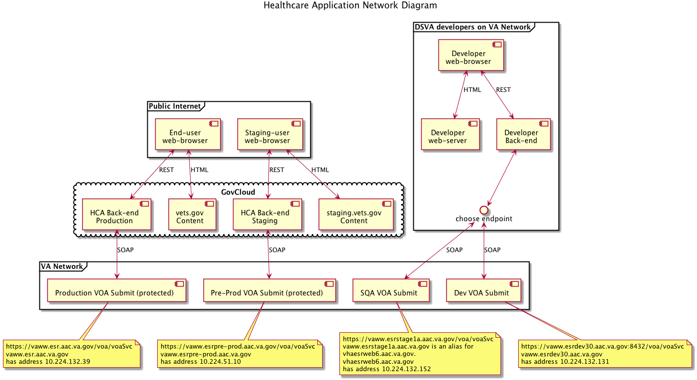
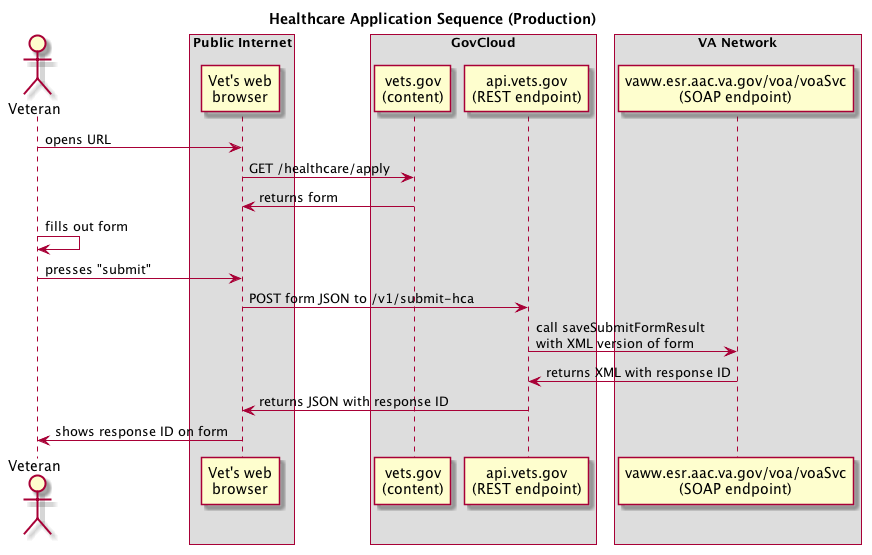

# Healthcare Application

## Project Background

### Back-end

The backend receives a JSON object from the front-end containing a Vet's 1010ez request and
sends it to an ES endpoint. The ES endpoint response is then returned to the front-end.

The backend uses _Express/Strongloop/loopback_ and the associated `loopback-soap-connector` module
to serve the REST API to the front-end, convert JSON structures into SOAP-friendly XML, and manage
connections and responses from end endpoint.

#### High-level design




(TODO: some words to go along with these diagrams)

### Development setup

#### Node.js

##### The requirements for running this application are Node.js 4.4.4 and npm 3.8.9.
You should use Node Version Manager (nvm) to manage the versions of node.js on your local machine.
To install please visit: https://github.com/creationix/nvm
_If you are on a mac and use [homebrew](http://brew.sh/), you can install nvm by typing: brew update && brew install nvm_

Once you have nvm installed you should now install node.js version 4.4.4 by running: 

```bash
nvm install 4.4.4
```

Once you have node.js version 4.4.4 installed install npm version 3.8.9 by running:

```bash
npm i -g npm@3.8.9
```
##### Verify your local requirements are set
```bash
node --version // 4.4.4
npm --version  // 3.8.9
```

Checkout the repository: 

```bash
git clone git@github.com:department-of-veterans-affairs/healthcare-application.git
```

Install the node.js project dependencies:

```bash
npm install
```

#### Development example of interaction with ES servers

There are multiple environments for the ES servers. To use any of them, you must
be on a machien that can access the VA internal network. Without this, the UI will
work but all submissions will end in a failure at the SOAP layer.

The 4 environments used are `dev`, `sqa`, `preProd`, and `prod`.  For `preProd`,
and `prod` you will need a certificate/key that has been registered by the ES team
for each of those environments. As a developer YOU WILL NOT LIKELY BE GIVEN ACCESS
TO THE NEEDED KEY. The `preProd` and `prod` endpoints are used on the deployed
staging and production servers. During normal development, test against `dev`
or `sqa`.

##### Selecting an ES endpoint

The server endpoints are configured in `config.json` via the
`config.soap.endpoint` and `config.soap.wsdl` keys.  See the `endpoint` object
for a list of the common server endpoints to use.

The configuration default is https SOAP requests sent to `esDev`. This should
just work when you are on the VA network.

##### Submit a form
You can either submit a form via the UI or by using CURL.

For the UI, visit:
```
http://localhost:3000/healthcare/apply/application
```

and then complete the form like a normal user. The SOAP request is sent when
the final "submit" is clicked.

Alternately, in development environments, you can enable the development
panel by adding `?devPanel=1` that adds some widgets for auto-populating
fields and jumping around the navigation flow.

```
http://localhost:3000/healthcare/apply/application?devPanel=1
```

For pure server development, it is often easier to write directly to the
REST API using curl.  This can be done with

```
scripts/submit.sh test/data/fake-application.json
```

If the submit succeeds, you should see a section a log line similar to:
```
node-soap Http response body: "<?xml version='1.0' encoding='UTF-8'?><S:Envelope xmlns:S=\"http://schemas.xmlsoap.org/soap/envelope/\"><S:Body><submitFormResponse xmlns:ns2=\"http://jaxws.webservices.esr.med.va.gov/schemas\" xmlns=\"http://va.gov/schema/esr/voa/v1\"><status>100</status><formSubmissionId>40124668140</formSubmissionId><message><type>Form successfully received for EE processing</type></message><timeStamp>2016-05-25T04:59:39.345-05:00</timeStamp></submitFormResponse></S:Body></S:Envelope>"
```

##### WSDL vs endpoint
Note that per WSDL spec, the WSDL file actually specifies the endpoint to use
so having the `wsdl` file location be a separete config from `endpoint` is
actually overriding the normal behavior.

In the current configuraiton, a snapshot of the WSDL config from the ES
development server has been committed into the codebase and modified such that
all remote resources are stored locally.

This is done intentionally because reading the wsdl file and then the associated
schema from the server is really slow. Also, in the absence of a network
connection, failure to read this file leads to an inability to create the soap
client object which makes many parts of the server code inaccessible.

On the down side, it means that when the server updates their WSDL our code
will not see the change.

To use the server WSDL, *remove* the `config.soap.wsdl` key. If `config.soap.wsdl`
is not defined, then the server will try to fetch the latest WSDL from the endpoint
using a GET request with a query string of `?wsdl`.

##### Retrieve a status

Status can be retrieved from the commandline using

```
scripts/status.sh [submisison number]
```

##### Certificates and trust stores.
Trust stores come into play in 2 situations:
  1. Our server's validation of the ES SOAP endpoint server TLS certificate
  2. [in preProd/prod] the ES SOAP endpoint's validation of our client certificate

For (1), the ES SOAP endpoint, for various reasons, sometimes presents a non-standard
trust chain where the end server certificate is signed by an issuer that is NOT
in the chain. In this situation, the `config.soap.serverCA` variable MUST
contain the issuer that immediately preceeds the end server certificate, and
it must also contain all certificates in the chain presented by the server
terminating in a self-signed CA certificate.

VA has 2 such chains, one rooted off the `VA Internal Root CA` and one rooted
off of `Federal Common Policy CA`. A different combination of these must be
used depending on the presented certificate.

Failing to present the right combination will either yield a `get local issuer certificate`
warning (means one of the certificates in the chain that is NOT the end certificate has
an issuer which is not specified in `config.soap.serverCA`) or
`unable to verify first certificate` which occurs if the first issuer is both not inside
the trust chain presented by the server and is not provided inside `config.soap.serverCA`.

If the server is correctly configured, `config.soap.serverCA` should really only contain
one entry for the last self-signed CA certificate that roots the whole chain, but that
is not how these servers are currently set up.

For (2), the ES system must to the equivalent of the above for us. On our side, we
must present a end certificate with the full trust chain up to our root certificate.
An example of this can be found in `certs/VA Healthcare Application - chain.pem`. Note
that the associated key is NOT commited into source control so this certificate is
not usable by itself. Without access to the server key, it is mostly interesting as a
format reference.

The common trust chain configurations can be found in config.js under the
`vaInternalChain` and `vaFederalCommonPolicyChain` constants.  The `ca` constant
maps envrionments to the needed chains to validate a SERVER (scenario #1 above).

##### ES Fault codes
The ES system validates data fields in addition to the validation done by our
own logic. Ideally the two should be in sync, but in the even they are not,
the ES system will respond with a soap error that lists a fault code
and a (generally correct) test description of the problem.


Fault codes can be found in the spreadsheet: `docs/VOA Data Elements and Validations.xlsx`. 

###### `faults.js`
This is a javascript mapping of a snapshot of the fault codes from the given spreadsheet.

```javascript
const faults = {
  "Fault Code": "Fault Text",
  "0001": "Missing required Field: Veteran Last Name",
  "0002": "Missing required Field: Veteran First Name",
  "0003": "Invalid middle name",
  "0005": "Invalid Veteran other names used",
  "0006": "Invalid Veteran's mother's maiden name",
  "0007": "Missing required Field:  Veteran SSN",
  "0008": "Invalid Veteran SSN value",
  "0009": "Missing required Field:  Veteran Date of Birth",
  "0238": "Invalid Veteran date of birth",
  "0011": "Veteran Date of Birth cannot be a  future date.",
  "0012": "Missing required Field: Veteran's gender",
  "0013": "Invalid Gender value for Veteran",
  "0014": "Invalid City of birth for Veteran",
  "0015": "Invalid State value.",
  "0016": "Missing required Field",
  "0017": "Invalid Marital Status.",
  "0018": "Missing required Field: Type of benefit applied for. ",
  "0020": "Missing required Field: Preferred VA Facility",
  "0021": "Invalid VA Facility",
  "0022": "Invalid ethnicity",
  "0029": "Invalid religion.",
  "0030": "Missing required Field:  Street for Veteran Permanent Address",
  "0031": "Missing required Field:  City for Veteran Permanent Address",
  "0032": "Missing required Field: State or Province for Veteran Permanent Address",
  "0033": "Invalid State or Province for Veteran Permanent Address",
  "0240": "Missing required Field: Country for Veteran Permanent Address",
  "0223": "Invalid country for Veteran Permanent Address",
  "0034": "Missing required Field: Veteran Permanent Address Zip Code",
  "0035": "Invalid Zip Code for  Veteran Permanent Address",
  "0230": "Invalid Zip Code plus 4 for  Veteran Permanent Address",
  "0036": "Invalid Veteran email address. ",
  "0037": "Invalid Veteran Home Phone Number",
  "0038": "Invalid Veteran cellular phone Number",
  "0039": "Missing required Field:  Next of kin last name",
  "0040": "Missing required Field: Next of kin first name",
  "0041": "Invalid street address for next of kin",
  "0042": "Invalid City  for next of kin address",
  "0043": "Invalid State or Province for Next of Kin state",
  "0241": "Missing required Field: Country Next of Kin",
  "0224": "Invalid country for Next of Kin address",
  "0044": "Invalid Zip Code for next of kin Address",
  "0231": "Invalid Zip Code plus 4 for next of kin Address",
  "0045": "Missing required Field: Relationship to Veteran of next of kin",
  "0046": "Invalid relationship value for next of kin",
  "0047": "Invalid next of kin home telephone number",
  "0048": "Invalid next of kin work telephone number",
  "0049": "Missing required Field: Emergency contact last name",
  "0050": "Missing required Field: Emergency contact first name",
  "0051": "Invalid street address for Veteran's emergency contact",
  "0052": "Invalid City  for Veteran's emergency contact address",
  "0053": "Invalid State or Province for Emergency contact address",
  "0242": "Missing required Field:  Country for Emergency contact address",
  "0225": "Invalid country for Emergency contact address",
  "0054": "Invalid Zip Code for emergency contact address",
  "0232": "Invalid Zip Code for emergency contact address",
  "0055": "Missing required Field:  Relationship for emergency contact",
  "0222": "Invalid relationship value for emergency Contact",
  "0056": "Invalid home telephone number for emergency contact",
  "0057": "Invalid emergency contact work phone number.",
  "0059": "Missing required Field: Name of Insurance Company",
  "0060": "Invalid street address for Insurance company",
  "0061": "Invalid City for Insurance company address",
  "0062": "Invalid state or province for insurance company",
  "0243": "Missing required Field: Country for Insurance Company",
  "0226": "Invalid country for insurance company",
  "0063": "Invalid zip code for insurance company",
  "0233": "Invalid zip code plus 4 for insurance company",
  "0064": "Invalid phone number for insurance company",
  "0065": "Missing required Field:  Name of Insurance policy holder",
  "0066": "Missing required Field:  Insurance policy number or group code",
  "0068": "Missing required Field: Medicaid eligibility",
  "0069": "Missing required Field: Medicare Insurance Part A enrollment.",
  "0070": "Missing required Field: Effective date of Medicare Insurance Part A enrollment ",
  "0071": "Invalid Medicare part A effective date",
  "0072": "Missing required Field: Medicare Insurance Part B enrollment.",
  "0227": "Invalid medicare enrollment.  If enrolled in Medicare Part B, then Part A enrollment and Part A enrollment effective date must be provided.  ",
  "0073": "Missing required Field: Effective date of Medicare Insurance Part B enrollment ",
  "0074": "Missing required Field: Name on Medicare card",
  "0075": "Missing required Field: Medicare claim number",
  "0076": "Missing required Field:  Veteran's employment status",
  "0077": "Invalid employment status ",
  "0078": "Missing required field: Veteran date of retirement",
  "0079": "Invalid date of retirement for Veteran",
  "0080": "Missing required field: Name of Veteran's employer",
  "0081": "Missing required field: Address of Veteran's employer",
  "0082": "Invalid street address for Veteran’s employer",
  "0083": "Missing required field: City of Veteran's employer",
  "0084": "Missing required field: State or province for Veteran's employer",
  "0085": "Invalid state or province for Veteran's employer",
  "0244": "Missing required field: Country for Veteran's employer",
  "0228": "Invalid country for Veteran's employer",
  "0086": "Missing required field: Zip Code of Veteran's employer",
  "0087": "Invalid zip code for Veteran's employer",
  "0234": "Invalid zip code plus 4 for Veteran's employer",
  "0088": "Invalid phone number for  Veteran's employer",
  "0089": "Missing required field: Spouse's employment status",
  "0090": "Missing required field: Spouse's date of retirement",
  "0091": "Invalid date of retirement for spouse",
  "0092": "Missing required field: Name of Spouse's employer ",
  "0093": "Invalid value for the Name of Spouse's employer ",
  "0094": "Missing required field: Street address of Spouse's employer",
  "0095": "Invalid value for Street address of Spouse's employer",
  "0096": "Missing required field: City of Spouse's employer",
  "0097": "Invalid value for City of Spouse's employer",
  "0098": "Invalid value for State or Province for Spouse's employer",
  "0099": "Missing required field: State or Pronince for Spouse's employer",
  "0237": "Missing required field: Country of Spouse's employer",
  "0245": "Invalid country for Spouse's employer",
  "0100": "Invalid zip code for Spouse's employer",
  "0235": "Invalid zip code plus 4 for Spouse's employer",
  "0101": "Missing required field: Zip code for Spouse's employer",
  "0102": "Invalid phone number for Spouse's employer",
  "0103": "Missing required Field:  Last branch of service",
  "0104": "Invalid Branch of service entered",
  "0105": "Missing required Field:  Last service entry date",
  "0106": "Invalid format for Last Service Entry Date",
  "0107": "Missing required Field:  Last service discharge date",
  "0108": "Invalid format for Last Service Discharge Date",
  "0109": "Missing required Field: Type of Discharge",
  "0110": "Invalid discharge type value",
  "0111": "Invalid value for military service number. Value must be between 1 and 10 characters in length. ",
  "0113": "Missing required field:  Spouse last name",
  "0114": "Invalid Spouse last name",
  "0115": "Missing required field:  Spouse first name",
  "0116": "Invalid Spouse first name",
  "0117": "Invalid Spouse middle name",
  "0119": "Invalid Spouse maiden name or other names used",
  "0120": "Missing required field:  Spouse Social Security Number",
  "0121": "Invalid value for Spouse's Social Security Number",
  "0122": "Missing required field:  Spouse's Date of Birth",
  "0123": "Invalid Spouse date of birth",
  "0124": "Yr required if Marr/Sep, or spouse entered.",
  "0125": "Missing required Field: Did your spouse live with you last year",
  "0127": "Value outside range of  0 to 9999999.99 for amount you contributed last calendar year to support spouse",
  "0128": "Missing required Field: Spouse street address",
  "0129": "Missing required Field: City for Spouse address",
  "0130": "Missing required field: State or province for Spouse address",
  "0131": "Invalid state or province for Spouse address",
  "0246": "Missing required field: Country for Spouse address",
  "0229": "Invalid country for Spouse address",
  "0132": "Missing required field: Zip code for Spouse address",
  "0133": "Invalid Zip Code for spouse's address",
  "0236": "Invalid Zip Code plus 4 for spouse's address",
  "0134": "Invalid phone number for spouse",
  "0135": "Missing required field:  child's last name",
  "0136": "Invalid value for Child's last name",
  "0137": "Missing required field:  Child's first name",
  "0138": "Invalid value for Child's first name",
  "0139": "Invalid value for Child's middle name",
  "0141": "Missing required Field: Child's relationship to Veteran ",
  "0142": "Invalid value for child's relationship to Veteran ",
  "0143": "Missing required Field: Child's SSN ",
  "0144": "Invalid Child's SSN value ",
  "0145": "Missing required Field: Date child became your dependent ",
  "0146": "Invalid date when child became dependent ",
  "0147": "Date child became dependent cannot be a future date ",
  "0148": "Missing required Field: Child's date of birth ",
  "0149": "Invalid child's date of birth ",
  "0150": "Child's date of birth cannot be a future date ",
  "0151": "Missing required Field: Was child permanently and totally disabled before age of 18 ",
  "0154": "Value outside range of  0 to 9999999.99 for expenses paid by child for college, vocational rehabilitation or training",
  "0156": "Missing required Field: Did your child live with you last year",
  "0158": "Value outside range of  0 to 9999999.99 for amount you contributed last calendar year to support child",
  "0160": "Missing required Field: Gross annual income from employment for Veteran",
  "0161": "Value outside range of  0 to 9999999.99 for gross annual income from employment for Veteran",
  "0163": "Missing required Field: Gross annual income from employment for spouse ",
  "0164": "Value outside range of  0 to 9999999.99 for gross annual income from employment for spouse ",
  "0166": "Missing required Field: Gross annual income from employment for child ",
  "0167": "Value outside range of  0 to 9999999.99 for gross annual income from employment for child ",
  "0169": "Missing required Field: Net income from property or business for Veteran",
  "0170": "Value outside range of  0 to 9999999.99 for net income from property or business for Veteran",
  "0172": "Missing required Field: Net income from property or business for spouse ",
  "0173": "Value outside range of  0 to 9999999.99 for net income from property or business for spouse ",
  "0175": "Missing required Field: Net income from property or business for child ",
  "0176": "Value outside range of  0 to 9999999.99 for  net income from property or business for child ",
  "0178": "Missing required Field: List other income amounts for Veteran",
  "0179": "Value outside range of  0 to 9999999.99 for list other income amounts for Veteran",
  "0181": "Missing required Field:  List other income amounts for spouse ",
  "0182": "Value outside range of  0 to 9999999.99 for list other income amounts for spouse ",
  "0184": "Missing required Field: List other income amounts for child ",
  "0185": "Value outside range of  0 to 9999999.99 for list other income amounts for child ",
  "0187": "Missing required Field: Total non-reimbursed medical expense paid by Veteran or spouse",
  "0188": "Value outside range of  0 to 9999999.99 for  total non-reimbursed medical expense paid by Veteran or spouse",
  "0190": "Missing required Field: Amount you paid last calendar year for burial expenses",
  "0191": "Value outside range of  0 to 9999999.99 for amount you paid last calendar year for burial expenses",
  "0193": "Missing required Field: Amount you paid last calendar year for educational expenses",
  "0194": "Value outside range of  0 to 9999999.99 for amount you paid last calendar year for educational expenses",
  "0196": "Missing required field: Cash, amount in back accounts for Veteran",
  "0197": "Value outside range of  0 to 9999999.99 for cash, amount in back accounts for Veteran",
  "0199": "Missing required field: Cash, amount in back accounts for spouse ",
  "0200": "Value outside range of  0 to 9999999.99 for cash, amount in back accounts for spouse  ",
  "0202": "Missing required field: Cash, amount in back accounts for child ",
  "0203": "Value outside range of  0 to 9999999.99 for cash, amount in back accounts for child  ",
  "0205": "Missing required field: Market value of land/buildings/lien for Veteran",
  "0206": "Value outside range of  0 to 9999999.99 for market value of land/buildings/lien for Veteran",
  "0208": "Missing required field: Market value of land/buildings/lien for spouse ",
  "0209": "Value outside range of  0 to 9999999.99 for market value of land/buildings/lien for spouse ",
  "0211": "Missing required field: Market value of land/buildings/lien for child ",
  "0212": "Value outside range of  0 to 9999999.99 for market value of land/buildings/lien for child ",
  "0214": "Missing required field: Value of other property or assets for Veteran",
  "0215": "Value outside range of  0 to 9999999.99 for value of other property or assets for Veteran",
  "0217": "Missing required field:  Value of other property or assets for spouse ",
  "0218": "Value outside range of  0 to 9999999.99 for  value of other property or assets for spouse ",
  "0220": "Missing required field: Value of other property or assets for child ",
  "0221": "Value outside range of  0 to 9999999.99 for value of other property or assets for child ",
  "0239": "VOA system is currently not available",
  "0248": "Missing required field for 10-10EZ Application:  Application Date",
  "0249": "VOA Anonymous/Level1 Process Indicator is false:  Please forward the application to facility",
  "0250": "Missing required field: Authentication Level for VOA Application is required:  Please enter your authentication level",
  "0251": "Missing required field: Fully qualified Identifier is required for Assurance Level 1 and above:  Please enter your ID",
  "0252": "Missing required field: COVERAGE UNDER THE AFFORDABLE CARE ACT",
  "0253?": "Missing required field: Demobilizing State",
  "0254?": "Invalid Demobilizing State",
  "0255?": "Missing required field: Demobilizing Site",
  "0256?": "Invalid Demobilizing Site",
  "0257?": "Missing Required field: Date released from Active duty",
  "0258?": "Invalid Date released from Active duty",
  "0259? Confirm with George/ Shaopeng first": "Invalid Race",
};
```

#### OPTIONAL: End-to-end tests

We use [Nightwatch](https://github.com/nightwatchjs/nightwatch) and [SauceLabs](https://saucelabs.com) to run end-to-end tests on a variety of platforms.

If you'd like to run end-to-end (e2e) tests locally, you'll need to install Selenium and Java: 

``` bash
brew update && brew install Caskroom/cask/java && brew install selenium-server-standalone
```

To get started you will need to start selenium server to do that run:

``` bash
selenium-server -p 4444
```

Once selenium server is running, in a seperate terminal you should be able to run the e2e tests by running: 

```bash
npm run tests:e2e
```

##### Mocking the API for e2e tests
The backend API is a pass-through to a soap service which is not accessible during testing.
To facilitate complete end-to-end tests, the API server can be placed into mock mode by setting
the `HCA_MOCK_API=1` environment variable.

```
HCA_MOCK_API=1 npm run watch
```

is possibly a way to develop against it.

End-to-end tests can then configure the mock by POSTing short configuration command to
the `api/hca/v1/mock` endpoint.  Commands are are `application/json` POST bodies with the
following structure:

```
{ resource: 'endpoint', value: '{more_json:1}', verb: 'get' }
```

POSTing this to command would make GET requests to `/api/hca/v1/endpoint` return `{more_json:1}`.
Note that the verb can be left out and it will default to `get`. The verb is case insensitive.


### Docker
#### Environment setup
Docker is being used for Travis deploys of this application. The Dockerfile
builds an Alpine Linux based node environment.

On OsX and Windows, Docker does not yet have native kernel support. Instead, a
wrapper program `docker-machine` is used to boot a minimal linux virtual machine
that then executes the docker commands. To set this up, just run
```
docker-machine start
```

This starts the `default` Docker virtual machine (previously known as boot2docker)
This should only need to be done once per boot of your actual machine since the
VM continues to run in the background.

Note that the result of all docker builds are actually housed within this
virtual machine and over time you can run it out of diskspace. Search
online for instructions for handling such a situation.

Aftr the machine has started, ensure the environment variables necessary for
connecting to the machine are set by running
```
eval $(docker-machine env)
```

To find the IP address of the docker-machine, run
```
docker-machine ip
```


#### Building the container
To build a new container tagged `awongdev/hca-staging`, from the root of the repostiory run:

```
scripts/make-docker.sh
```


#### Running the container
To run the built container:
```
scripts/run-docker.sh
```
