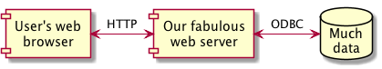

# HCA diagram how-to

I like tools. I especially like tools that draw pictures.

This directory holds files of extension `.puml` that the tool
named _PlantUML_ generates diagrams from.

While PlantUML can generate a variety of diagrams, I only include two
variants here:

* Component diagram - shows system elements and the connections between them (sometimes known as a data flow diagram)
* Sequence diagram - shows system elements and connections on one axis and time flow on the other axis (sometimes known as a swim-lane diagram)

## Example component diagram

This shows a browser, webserver, and a database:

```
@startuml

[User's web\nbrowser] as browser
[Our fabulous\nweb server] as server
database "Much\ndata" as mysql

browser <-> server : HTTP
server <-> mysql : ODBC

@enduml
```



## Example sequence diagram

```
@startuml

actor "Valued user" as user
participant "User's web\nbrowser" as browser
participant "Our fabulous\nweb server" as server
database "Much\ndata" as mysql
participant "Plenty of kitten\npictures" as store

user -> browser : navigates to our URL
browser -> server : requests URL
server -> browser : returns search page
user -> browser : types 'kittens' in search box
brower -> server : submits 'kittens' to search URL
server -> mysql : searches for 'kittens'
mysql -> server : returns list of kitten pictures
server <-> store : request list of kitten pictures
server -> browser : returns kitten pictures

@enduml
```

This shows the elements mentioned above for a web query:

## PlantUML installation

### OSX

1. Install Homebrew (url)
1. `brew install graphviz`
1. `brew install plantuml`

### Debian-based Linux

1. `sudo apt-get install graphviz plantuml`

## PlantUML usage

PlantUML generates pictures in a number of formats. Review the documentation for
the full list.

The formats I find most useful are:

* `png` (simple bitmap)
* `svg` (web-friendly vector)
* `pdf` (Acrobat-compatible format)
* `eps` (useful for inclusion in word-processing files).

As an example, this is how I generated the component diagram shown above
as a `png` file:

```
plantuml -tpng ex1-component.puml
```

...which will output a file named `ex1-component.png`.


To generate output in the other formats, use the format specifiers shown above.